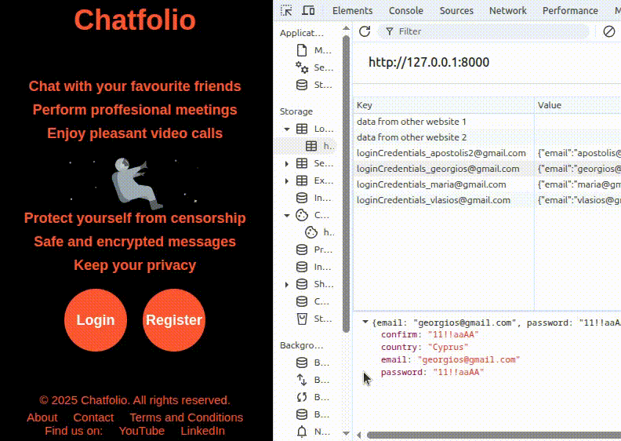
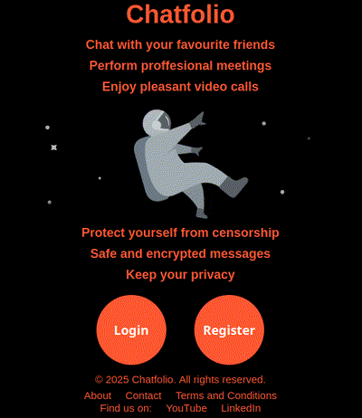

# Chatfolio

## 🌍 Overview
Chatfolio is a full-stack web development portfolio project that is built with several web technologies. It consists of two main Django Apps: a) `accounts_app` and b) `chat_app` (under development). The project emphasizes **security**, **performance**, and **user experience**, showcasing best practices in web development.


### 🎬 Demo
<div>
  <p align="center">
    
  </p>
  
  <p align="center">
    
    
  </p>
</div>


## 📌 Features

### 🔒 Security
- **🥷 CSRF & Session Protection:** `HTTP POST`/`JSON POST` requests to our server are protected with CSRF tokens and secure session handling.
- **👤 Login Required Middleware:**  
  - Prevents unauthorized access to `chat_app` URLs.  
  - Ensures each authorized user has access only to their own media files.  
  - Allows Admin users to have full access to all media files.
- **🍪 Cookie Protection:** All cookies are protected against a) `CSRF attacks`, b) `XSS attacks`, and c) `malicious JavaScript` that attempts to read their contents.  
- **🔑 Secure Password Storage:**  
  - Passwords are salted and hashed iteratively to protect against `Rainbow Table attacks`.  
  - Users with identical passwords will have distinct hashes stored in the database.
- **🔐 Securely Load Environment Variables:** Sensitive settings such as `SECRET_KEY` and `DEBUG` are stored in the .env file (which is not uploaded on GitHub if we set the .gitignore properly) rather than in the publicly available settings.py.
- **🔄 Database & Filesystem Sync:** Media files are consistently synchronized with the database to ensure integrity.
- **🛡️ Secure HTTPS Redirections:** Sensitive requests are enforced to use HTTPS to guarantee encrypted and secure data transfer.
- **⚛️ Atomic Transactions:** Changes to the database and media files are handled atomically where appropriate, preventing partial updates and ensuring data integrity.  
- **🚫 Double HTTP POST Prevention:** A Mechanism is employed to prevent duplicate form submissions or accidental double POST requests.
- **✅ ⚠️ Validation & Error Handling:** All user input is validated server-side, and errors are handled gracefully without breaking the application with `404 Not Found` and `5xx Server Errors`, ensuring the page does not crash or break.

  
### 🎯 User Experience
- **🏁 Smooth & Controlled Page Loading:** using JavaScript and Event Listeners to prevent abrupt visual changes.
- **📱 💻 Responsive Layout:** Compatibility with different screen sizes (i.e. mobiles, tablets, laptops).
- **⏳ Lazy Loading:** while waiting for time-consuming requests to make clients not bored.  
- 🎨 Beautiful CSS styles and amazing animations
- 💬 Popup elements for enhancing interactivity.
- 🔌 Graceful degradation in case JavaScript is disabled in the browser.  


### 🚀 Performance
- **🗂️ Static Files Optimization:**  
  1. **🖼️ Spritesheets:** Multiple images combined into a single spritesheet with JSON coordinates with efficient extraction on the client-side via JavaScript, reducing HTTP requests.  
  2. **🗜️ ZIP Archives:** Many static files are bundled into a single ZIP file with real-time extraction on the client-side via JavaScript, reducing HTTP requests.  
  3. **✂️ HTML/CSS/JS Minification:**  
     - All files with the same file type are automatically concatenated to minimize HTTP requests.  
     - Whitespaces and Comments are removed to reduce File Size and Bandwidth.
- **🥷 Event Delegation:** Widely used for efficient DOM manipulation, reducing memory leaks, improving performance, and coding flexibility.  
- **⚡ Asynchronous Requests:** Dynamic content updates without full page reloads.  
- **✅ ⚠️ Validation & Error Handling:** Efficient handling of HTTP errors to prevent page crashes.
- **🍪 💾 Cookies & localStorage:** Session management, preferences, and user interactions.  
- **🧹💧 No Memory Leakage:** No Global Variables, Single-use Event Listeners are effectively deleted, etc, ensuring the browser does not slow down or crash.
- **🛠️ Maintainance & Scalability:** Clean, easily readable and maintainable code, well-organised in many files/folders.


## 🔧 Technologies
- 🐍 Django, Python, SQLite
- 🌐 HTML, CSS, JavaScript, jQuery
- ⚡ Asynchronous JSON Requests
- 🧭 Additional tools for minification, spritesheet generation, and async handling


## ⚙️ Installation & Setup
Follow the steps below to set up and deploy the **Chatfolio Project** on your machine.

### 1️⃣ Create and Activate a Virtual Environment
```bash
python3 -m venv Chatfolio-Environment
source Chatfolio-Environment/bin/activate
```
### 2️⃣ Clone the Repository
```bash
git clone git@github.com:Apostolis-Greece/Chatfolio.git
cd Chatfolio
```
### 3️⃣ Install Dependencies
```bash
pip install -r requirements.txt
```
### 4️⃣ Apply Database Migrations
```bash
python3 manage.py makemigrations accounts_app; python3 manage.py migrate accounts_app; python3 manage.py makemigrations chat_app; python3 manage.py migrate chat_app; python3 manage.py makemigrations; python3 manage.py migrate;
```
### 5️⃣ Database Bulk Load with Fake User Accounts (Optional)
```bash
python3 manage.py collectstatic --noinput
python3 manage.py bulk_load_fake_users --number 100
```
### 6️⃣ Run the Development Server
💡 Tip: 0.0.0.0:8000 makes the server accessible to other devices on the same LAN.
```bash
python3 manage.py compress; python3 manage.py collectstatic --noinput; python3 manage.py runserver 0.0.0.0:8000;
```
### 6️⃣ Connect as a Client
#### 🇦 Same Machine (Client & Server)
```bash
http://localhost:8000
```
#### 🇧 Different Machine (e.g., Clients are Smartphones, Tablets, PCs etc., Server is a PC)
⚠️ **Attention:** Both client and server must be on the **same LAN network** (e.g. same Wifi network)
- **Find Server IP:**
On the server machine, run:
```bash
ifconfig
```
Note the Local IP (e.g., something like `192.168.1.X`)

- **Connect Clients to the Server:**
On the client devices, open a browser and access the Server's Local IP address found above:
```bash
http://192.168.1.X:8000
```
